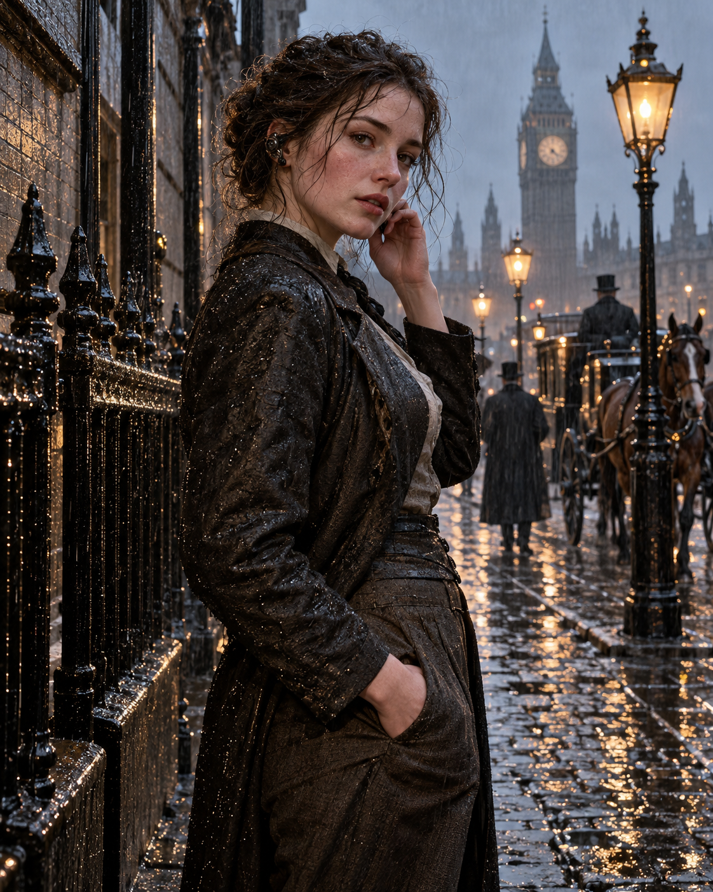
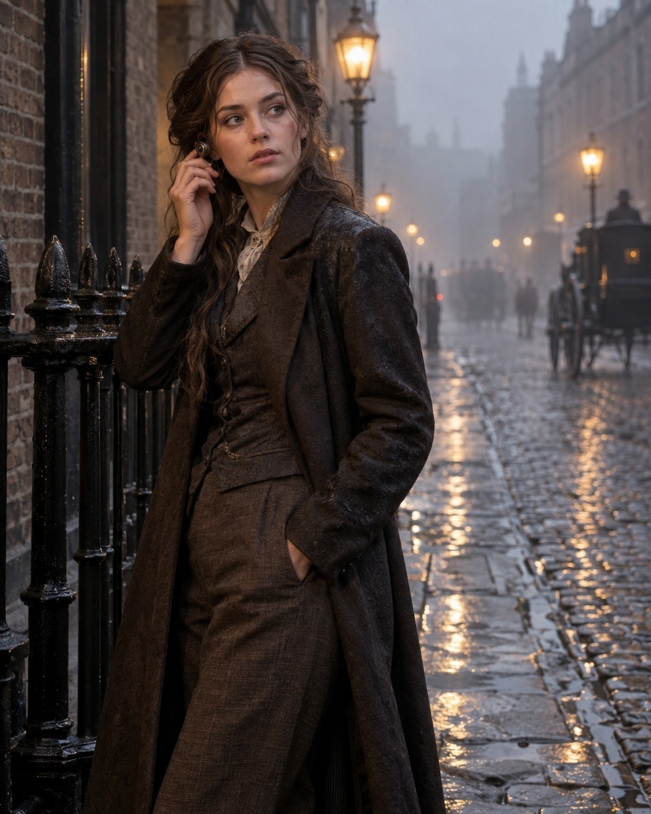
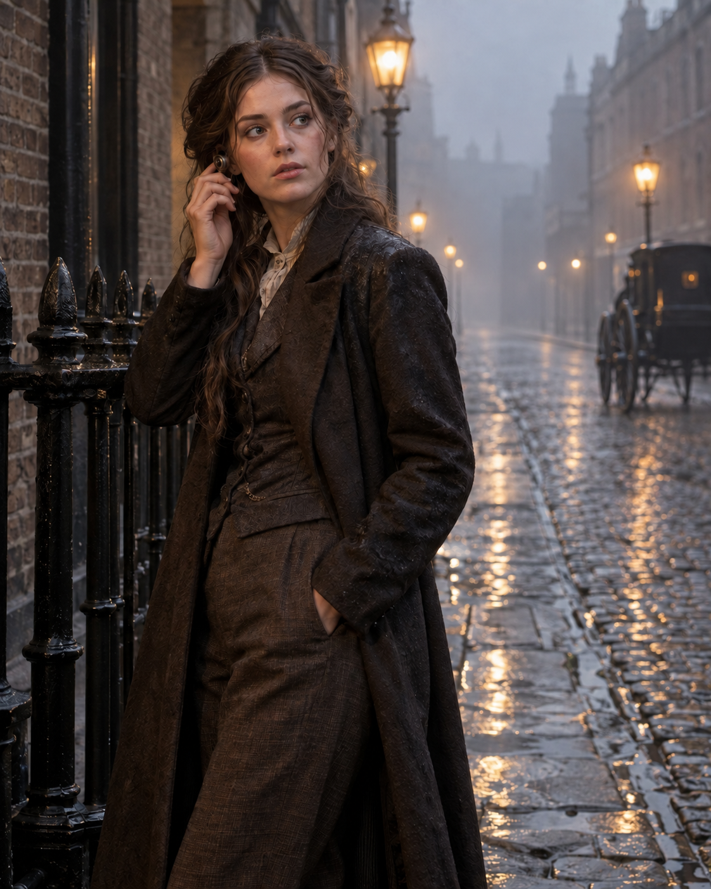

# 04｜轉換工作流視覺驗收：單次生成與後續修正

測試日期：2026-09-12

這份紀錄從一份已存在的舊式 prompt 開始，依序保存來源 prompt、執行遷移稿，再對未通過的 QA 做一次後續圖片編輯。每個 prompt 都只透過 Codex 內建圖片生成工具執行一次。

工具沒有向本次工作流公開確切的後端模型名稱、seed 或取樣設定，因此這是**本次 prompt conversion workflow 的可見結果與驗收紀錄**。它不能當成 GPT Image 2.5 API 的受控模型基準，不能證明輸出確實來自 GPT Image 2.5，也不能證明遷移稿在每次生成都優於來源 prompt。

## 工作流資料

```yaml
source_origin: unknown
source_tool: unknown
target: GPT Image 2.5
conversion_profile: physical_realism_v2
workflow_sequence:
  - migration_convert
  - migration_repair
execution_backend: unknown
```

`target` 記錄 prompt 的預定遷移目標；`execution_backend: unknown` 記錄這次內建工具實際未公開後端。兩者不能混為同一項模型證明。

## A. 來源 prompt

```text
Create a portrait-oriented 4:5 photorealistic street photograph for a public prompt-engineering comparison example. An adult woman stands on a late-19th-century London street after rain, her body turned about 60 degrees to the camera, right hand lightly touching a small period-inspired earpiece, left hand in her trouser pocket, with gas lamps behind her. 8K masterpiece ultra realistic IMAX HDR, raw, natural imperfections, physics imperfections, wet Victorian street, wet iron railings, wet brick walls, wet clothing, every surface covered in water droplets, ultra-detailed reflective textures everywhere, countless individual flyaway hair strands, cinematic lighting, extreme sharpness, intense micro-contrast. No captions, labels, signatures, logos, or watermarks. This is the deliberately overloaded ORIGINAL prompt sample; follow it as written rather than improving its wording.
```



## B. 遷移稿

```text
Create a photorealistic portrait-oriented 4:5 street photograph. In late-19th-century London, one adult woman stands beside a black iron railing on a street just after rain. Her body is turned about 60 degrees to the camera, her right hand lightly touches a small period-inspired earpiece, and her left hand rests naturally in her trouser pocket. Her relaxed posture feels like a brief moment caught by a street photographer.

Rainwater collects mainly between the cobblestones and in shallow low points; higher stones retain only patches of darker damp color. The railing is smooth black painted metal with a few downward water streaks on its vertical surfaces. Larger warm reflections appear only where a surface faces a gas lamp at a plausible reflection angle. The brick wall remains ordinary aged brick without exaggerated texture.

Her coat is damp from the rain, with slightly darker areas on the shoulders and sleeves, but the fabric does not sparkle with dense droplets. Her long hair is defined first by several naturally weighted masses falling with gravity. Only a limited number of loose strands cling near her cheeks, ears, and points of contact with her shoulders; the whole hairstyle does not float or move at once.

Fog is concentrated in the middle and far distance, gradually lowering the contrast of distant buildings and carriages while the foreground subject and railing remain clear. Gas lamps provide localized warm light; the overcast sky and mist provide cool ambient light. Warm and cool transitions follow the orientation of each surface. Use the natural perspective of a standard documentary lens, focus on the woman, moderately soften the background, and retain normal photographic tonal transitions, lens contrast, and restrained sharpening.

Every visible irregularity should result from material, gravity, contact, moisture, or lighting. Do not add decorative grain, scratches, grime, dense all-over droplets, extreme HDR, or texture enhancement merely to signal realism. No modern street objects, extra people, captions, labels, signatures, logos, or watermarks.
```



## 第一次驗收

| 驗收項目 | 來源結果 | 遷移稿結果 |
|---|---|---|
| 直式約 4:5 | 通過，1122×1402 | 通過，1122×1402 |
| 主角動作 | 通過：右手碰耳部裝置、左手插袋 | 通過 |
| 雨水與反光分布 | 大量表面同時閃亮，符合原稿的過量描述 | 較集中於路面、欄杆與局部衣料；仍有可見濕亮感 |
| 頭髮組織 | 散髮與細碎線條較多 | 大髮束較清楚，散髮數量較收斂 |
| 霧的空間層次 | 有霧，但背景細節仍多 | 中遠景對比較低，前後層次較清楚 |
| 只有一名人物 | 來源 prompt 未要求，畫面出現多人 | **未通過**：遷移稿雖禁止額外人物，遠景仍出現人影 |
| 文字、Logo、浮水印 | 通過 | 通過 |

第一次遷移稿沒有完全通過 QA，因此不能只展示較好看的部分後宣稱轉換成功。下一步只處理背景人物，並再次檢查原本應保留的內容。

## C. 後續修正

輸入圖片：`physical-realism-refined.png`

以下是當時實際送出的圖片編輯 prompt。為保留測試紀錄，它維持原本的 `Narrow edit` 用語；在本專案定位中，這一步是遷移工作流未通過 QA 後的單次修正，不代表另一項從零撰寫 prompt 的功能。

### Repair record

- `mode`: `migration_repair`
- `source_prompt`: A 節保存的完整來源 prompt。
- `prior_converted_prompt`: B 節保存的遷移稿。
- `failure_evidence`: B 節的單次輸出仍有可辨識的遠景人物，違反「No ... extra people」。
- `repair_scope`: 只移除中遠景人物，並重申來源與遷移稿中已要求保留的主角、動作、構圖、光線和年代場景。

```text
Narrow edit of the supplied image. Change only the middle and far background: remove every additional human figure, pedestrian, driver, and human silhouette so the street behind the main woman is visibly empty. Reconstruct the vacated areas as continuous wet cobblestones, cool mist, softened late-19th-century buildings, and the existing atmospheric depth. A distant unattended carriage may remain only if it contains no visible person.

Must preserve the main woman exactly: same identity, face, expression, eye direction, body angle, right hand touching the period-inspired earpiece, left hand in her trouser pocket, hair masses and limited loose strands, clothing, proportions, placement, and scale. Preserve the black railing, gas-lamp positions, warm/cool lighting, fog density, camera viewpoint, crop, 4:5 orientation, depth of field, and photographic tonal character. Do not add any new people, objects, captions, labels, signatures, logos, or watermarks.
```



## 第二次驗收

- 背景人物與人影：通過；未見可辨識的人物，遠方無人馬車保留。
- 主角、雙手動作、耳部裝置、服裝與構圖：目視保持高度一致。
- 像素保持：不通過，也未承諾。續改前後全圖平均 RGB 絕對差為 `4.265/255`；主角區約 `3.202/255`，遠景區約 `5.995/255`。背景改動較大，但主角區仍不是像素相同。
- 尺寸與模式：1122×1402、RGB，與輸入一致。
- 文字、Logo、浮水印：通過。

## 檔案雜湊

| 檔案 | SHA-256 |
|---|---|
| `physical-realism-original.png` | `4d86a0bf0ed799d2cdc7cb62dc210ee4ad1610386bd7c69ac48255b81f15e705` |
| `physical-realism-refined.png` | `cf86266f84592274e7b45fc62132f7f434957362e1a9d462f6323e247e477df3` |
| `narrow-edit-empty-background.png` | `ce7b7796185814d6c63b7756b6408621fedfa80141ab7b50152531fdb0a6a5e6` |

這次實測只支持兩個有限、個案性的觀察：在這一組單次結果中，遷移稿對水分、材質、髮束、霧與光源的具體描述，對應到較少的全畫面同質化濕亮細節；後續修正移除了漏網的背景人物，但仍改動輸入圖片的其他像素。它不支持「特定詞必然改善」、「遷移稿普遍優於來源 prompt」或「編輯區域以外完全不變」的保證。
